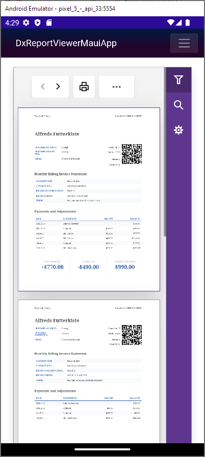

<!-- default badges list -->

<!-- default badges end -->
# Reporting for MAUI Blazor - Simple Report Viewer Application

This example is a .NET MAUI application that uses DevExpress Reporting libraries to create a report and display it in the Report Viewer.

## Files to Review

- [ReportViewer.razor](DxReportViewerMauiApp/Pages/ReportViewer.razor)
- [MauiProgram.cs](DxReportViewerMauiApp/MauiProgram.cs)
- [SharedExportProcessor.cs](DxReportViewerMauiApp/SharedReportExportProcessor.cs)

## Documentation
- [Use Reporting Tools in .NET MAUI Applications (macOS, iOS, Android)](https://docs.devexpress.com/XtraReports/404425/dot-net-maui-reporting/use-reporting-in-maui-apps?v=23.1)
- [MAUI Blazor App](https://docs.devexpress.com/Blazor/404121/get-started/blazor-hybrid/maui-blazor-app)

## More Examples

- [Use DevExpress MAUI and Blazor Components to Create a .NET MAUI Blazor Hybrid app](https://github.com/DevExpress-Examples/blazor-maui-hybrid-app)
